# Regelverkets Struktur och Läsguide

**Version:** 3.1
**Datum:** 2026-02-11
**Status:** Aktiv / Läsguide

---

## 1. Syfte och Läsordning

Detta dokument är den primära guiden för att förstå strukturen och innehållet i det federativa regelverket. För att få en god överblick rekommenderas följande läsordning:

1.  **Konceptuella grunder:** Börja med de [Styrande Principerna](konceptuella/styrande_principer.md) och den [Konceptuella Arkitekturen](konceptuella/konceptuell_arkitektur.md) för att förstå federationens syfte och mål.
2.  **Juridisk och processuell ram:** Fortsätt med [Federationspolicyn](normativa/federationspolicy.md) som sätter ramen. Se därefter på reglerna för anslutning av [Anslutningsoperatörer](normativa/federationsregler_for_anslutning_av_anslutningsoperator.md) och [Federationsmedlemmar](normativa/federationsregler_for_anslutning_av_federationsmedlem.md).
3.  **Tekniska krav:** Granska de [Tekniska anslutningsreglerna](normativa/tekniska_anslutningsregler_tjanster_komponenter.md) och [Informationssäkerhetskatalogen](normativa/nationell_kravkatalog_informationssakerhetskrav.md) för att förstå de tekniska åtagandena.

---

## 2. Regelverkets Gällande Struktur

Regelverket är hierarkiskt och uppdelat i separata artefakter för att främja modularitet. Nedan visas de centrala, **gällande** artefakterna som tillsammans utgör regelverket.

```mermaid
graph TD
    subgraph "A. Konceptuell & Övergripande Styrning"
        P[[styrande_principer.md]]
        CA[[konceptuell_arkitektur.md]]
        BL[[begreppslista.md]]
    end

    subgraph "B. Juridisk & Organisatorisk Ram"
        FP[[federationspolicy.md]]
        P --> FP
        FP --> A1 & A3
        A1[avtal_mellan_ledningsaktor_och_anslutningsoperator.md]
        A3[ansvarsfordelning_ledningsaktor_federationsoperator.md]
    end

    subgraph "C. Processer & Regler"
        FP --> R1 & R2 & P1
        R1[federationsregler_for_anslutning_av_anslutningsoperator.md]
        R2[federationsregler_for_anslutning_av_federationsmedlem.md]
        P1[anslutningsprocess_for_federationsmedlem.md]
    end
    
    subgraph "D. Kommersiell & Teknisk Grund"
        FP --> PM & TR
        PM[prismodell.md]
        TR[tekniska_anslutningsregler_tjanster_komponenter.md]
    end

    subgraph "E. Säkerhet & Krav"
        FP --> KR
        KR[nationell_kravkatalog_informationssakerhetskrav.md]
    end
```

---

## 3. Arkiverade Artefakter (Endast för Historik)

Som ett led i att förenkla regelverket har ett antal artefakter konsoliderats eller avvecklats. **Dessa har medvetet tagits bort från `README.md`** för att skapa en ren och tydlig ingång till det gällande regelverket.

Denna sektion är den enda platsen där dessa arkiverade artefakter listas, och syftet är endast att tillhandahålla historisk spårbarhet. De fysiska filerna har inte raderats, men deras innehåll har skrivits över för att förhindra oavsiktlig användning.

**Ersatta artefakter (Obsoleta):**
*   `anslutningsprocess_for_forlitande_part.md`
*   `anslutningsprocess_for_utfardare_av_behorighetshandling.md`
*   `deklarationsmall_for_forlitande_part.md`
*   `deklarationsmall_for_konsument.md`
*   `federationsregler_for_anslutning_av_forlitande_part.md`
*   `federationsregler_for_anslutning_av_utfardare_av_behorighetshandling.md`

**Avvecklade artefakter (Obsoleta):**
*   `krav_pa_avtal_mellan_anslutningsoperator_och_federationsmedlem.md`
