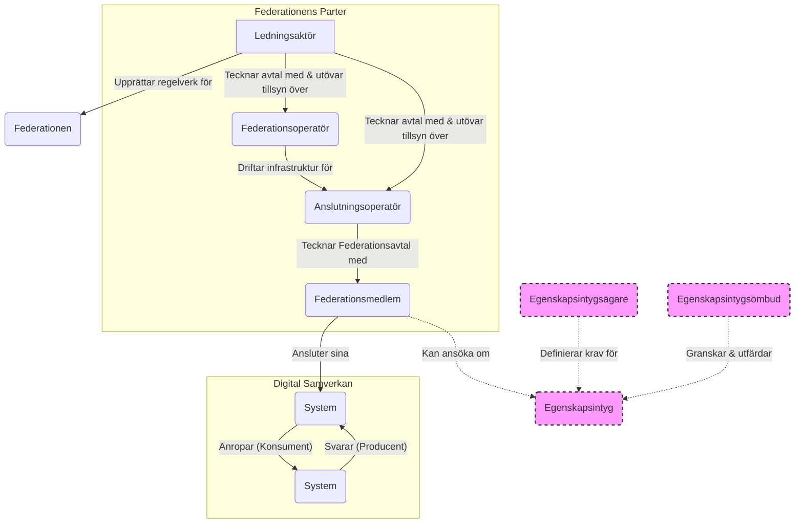

# Konceptuell Arkitektur
*Version 1.4 (Harmoniserad med styrande principer och avtalsstruktur)*

**Senast uppdaterad:** 2026-02-11

---

## 1. Inledning

Samordnad identitet och behörighet är ett byggblock i Ena - Sveriges digitala infrastruktur. Byggblockets mål är att med införandet av en nationellt gemensam identitets- och behörighetsfederation möjliggöra enklare etablering och förvaltning av digital samverkan över organisationsgränser.

Denna arkitektur beskriver de konceptuella modellerna för federationen. Den är utformad för att realisera och följa de fastställda **Styrande Principerna**, inklusive **P-04 Inbyggt dataskydd och säkerhet**, vilket säkerställer konsekvens, spårbarhet och en hållbar styrning.

## 2. Avtalsreglering

Avtalsstrukturen är fundamentet för tillit i federationen. Den är utformad för att realisera principerna om **Juridisk bundenhet i kedjan (P-01)**, **Delegerat ansvar och mandat (P-03)** och **Tydlig roll- och ansvarsfördelning (P-02)**.

Avtalskedjan är hierarkisk och delegerad:
1.  **Ledningsaktören** upprättar det övergripande Federationsregelverket.
2.  **Ledningsaktören** tecknar avtal med en eller flera **Federationsoperatörer** (om de är separata juridiska personer) och med en eller flera **Anslutningsoperatörer**.
3.  **Anslutningsoperatören** tecknar i sin tur avtal (Federationsavtal) med **Federationsmedlemmar**. Även om det inte finns ett direkt, bilateralt avtal mellan Ledningsaktören och Federationsmedlemmen, skapar Federationsavtalet en direkt och juridiskt bindande förpliktelse för Federationsmedlemmen att följa Regelverket, samt en självständig rätt för Ledningsaktören att agera vid regelbrott, helt i enlighet med P-01.

### 2.1. Federationsoperatörsavtal
Reglerar villkor för aktörer som vill etablera sig som Federationsoperatör.

### 2.2. Avtal med Anslutningsoperatör
Reglerar villkor för de aktörer som vill etablera sig som Anslutningsoperatör, inklusive deras delegerade mandat att ansluta medlemmar.

### 2.3. Federationsavtal
Detta avtal reglerar villkoren för de **Federationsmedlemmar** som ansluter sig. Det säkerställer att alla medlemmar juridiskt förbinder sig att följa det av Ledningsaktören fastställda federationsregelverket, i enlighet med **P-01**. Avtalet ska även specificera ansvarsfördelningen för personuppgiftsbehandling avseende de uppgifter som behandlas inom ramen för federationens drift (se avsnitt 3.4).

**Observera:** Federationsavtalet måste, via en ändringsklausul, säkerställa att Federationsmedlemmen är bunden av den vid var tid gällande versionen av Regelverket. Detta för att säkerställa att t.ex. informationssäkerhetskrav kan hållas uppdaterade.

### 2.4. Horisontell Tillit via Gemensamt Regelverk (Princip P-05)
Grunden för tillit mellan federationsmedlemmar (s.k. *horisontell tillit*) vilar på principen att alla, oavsett Anslutningsoperatör, har förbundit sig att följa samma federationsregelverk.

### 2.5. Samverkansavtal
Avtal för den faktiska samverkan (informationsutbytet) ligger utanför federationen och ingås mellan de samverkande parterna. Det är i dessa avtal som parterna måste reglera ansvarsfördelningen (PUA/PUB) för den verksamhetsdata som utbyts.

För ökad samhällelig interoperabilitet kring informationsutbyten rekommenderas användning av följande leverabler som tas fram inom Ena, Samordnad identitet och behörighet, eller andra standardiseringssammanhang:

1.  Nationella profileringar av OIDC och OAuth.
2.  Nationella definitioner för behörighetsgrundande attribut.
3.  Nationell publicering av attribut specifika för vissa verksamhetsområden.
4.  Nationellt etablerade attributprofiler.
5.  Nationell publicering av attributprofiler specifika för vissa verksamhetsområden.
6.  API-utformning i enighet med Diggs API-profil om det inte finns andra existerande API:er för aktuell samverkan (ex. FHIR för e-hälsodata).
7.  Nationella vägledningar kring hur standarder och mönster ska tillämpas.
8.  Nationellt harmoniserade krav i kravkatalogen för krav på organisationers och verksamheters förmågor, framförallt gällande informationssäkerhet.

---

## 3. Arkitekturell modell

Den arkitekturella modellen beskriver de roller, ansvar och tekniska flöden som realiserar federationen.

### 3.1. Modell för Roller och Relationer
Federationens styrning och drift baseras på de roller och relationer som definieras i detta avsnitt. Nedan följer en visuell översikt som illustrerar hierarkin och beroendena.

#### 3.1.1 Visuell Översikt över Relationer

*(Diagrammet ovan visar de primära relationerna. De streckade linjerna representerar den utökade tillitsmodellen (se avsnitt 4) som är en möjlig framtida utveckling.)*

### 3.2. Roller och Ansvar
Rollerna nedan utgör grunden för federationen. Ansvarsbeskrivningen är uppdelad i `SKA` (bindande krav) och `BÖR` (rekommendation).

#### 3.2.1. Ledningsaktören
1.  **SKA** ansvara för att upprätta och förvalta ett centralt federationsregelverk, inklusive en central katalog med informationssäkerhetskrav.
2.  **SKA** ansvara för att upprätta och förvalta en central katalog med definitioner av åtkomststyrande attribut.
3.  **SKA** ansvara för att upprätta och förvalta nationella profileringar, anvisningar och vägledningar.
4.  **SKA** ansvara för anslutning av, och tillsyn över, Federationsoperatörer och Anslutningsoperatörer.
5.  **BÖR** agera Egenskapsintygsägare för nationellt harmoniserade krav (se avsnitt 4).

#### 3.2.2. Federationsoperatör
1.  **SKA** etablera och drifta en tillitsankartjänst och andra centrala infrastrukturella komponenter enligt avtal med Ledningsaktören.
2.  **SKA** erbjuda en uppslags- och verifieringstjänst för sin del av federationsinfrastrukturen.

#### 3.2.3. Anslutningsoperatör
1.  **SKA** ansvara för upprättande av Federationsavtal med anslutande parter (Federationsmedlemmar).
2.  **SKA** erbjuda en uppslags- och verifieringstjänst.
3.  **SKA** stämpla (signera) tekniska komponenters validerade metadata i enlighet med federationsregelverket.
4.  **KAN** erbjuda en tjänst för publicering av anslutna tekniska komponenters metadata.

#### 3.2.4. Federationsmedlem
1.  **SKA** vara en juridisk person som ingått Federationsavtal med en Anslutningsoperatör.
2.  **SKA** efterleva villkoren i Federationsavtalet.
3.  **SKA** ansvara för sina anslutna tekniska komponenter (System) och sin regelefterlevnad.
4.  **SKA** realisera eller upphandla de komponenter som ska anslutas till federationen.
5.  **KAN** för en specifik samverkan agera Egenskapsintygsägare (se avsnitt 4).

#### 3.2.5. Användningsfallsroller (M2M-anrop)
För att beskriva det centrala användningsfallet används följande tekniska roller som innehas av ett `System` tillhörande en `Federationsmedlem`:
*   **Konsument**: Det `System` som anropar en resurs/ett API.
*   **Producent**: Det `System` som exponerar resursen/API:et och verifierar `Konsumentens` identitet. I denna kontext agerar `Producenten` som `Förlitande part`.

### 3.3. Tillitsmodell (Realisering av Principer P-01, P-05, P-08)
Tilliten bygger på en kombination av:
1.  **Federationsavtal (P-01)**: Juridisk bundenhet till regelverket.
2.  **Bindande Självdeklarationer (P-08)**: Juridiskt ansvar för teknisk korrekthet.
3.  **Gemensamt Regelverk (P-05)**: Grunden för horisontell tillit.
4.  **Rätt till Granskning**: Ledningsaktörens verktyg för att verifiera efterlevnad.

Denna grundläggande tillit kan vid behov byggas på med ytterligare mekanismer, såsom Egenskapsintyg (se avsnitt 4).

### 3.4. Ansvarsfördelning för Dataskydd (GDPR) - Realisering av Princip P-04

Principen om **Inbyggt dataskydd och säkerhet (P-04)** är fundamental. Ansvaret för personuppgiftsbehandling inom federationen är uppdelat. En tydlig distinktion måste göras mellan **federationsdata** och **verksamhetsdata**. Se [begreppslista.md](begreppslista.md) för definitioner av **Personuppgiftsansvarig (PUA)** och **Personuppgiftsbiträde (PUB)**.

#### 3.4.1. Ansvar för Federationsdata
Med **federationsdata** avses de personuppgifter som är nödvändiga för federationens drift och förvaltning, såsom:
*   Metadata om tekniska komponenter.
*   Kontaktuppgifter till tekniska och administrativa kontaktpersoner hos medlemmar.
*   Tekniska loggar för felsökning, säkerhet och revision (realisering av **P-09**).

För behandlingen av **federationsdata** är **Ledningsaktören** att betrakta som **Personuppgiftsansvarig (PUA)**. Ledningsaktören kan i sin tur anlita **Federationsoperatörer** och **Anslutningsoperatörer** som **Personuppgiftsbiträden (PUB)** för delar av denna behandling. Relationerna och ansvaret ska regleras i **Federationsoperatörsavtalet** och **Avtal med Anslutningsoperatör** via PUB-avtal.

#### 3.4.2. Ansvar för Verksamhetsdata
Med **verksamhetsdata** avses de personuppgifter som **Federationsmedlemmar** utbyter med varandra via de anslutna tjänsterna. Federationen tillhandahåller endast den tekniska och legala infrastrukturen för att möjliggöra ett säkert utbyte.

För behandlingen av **verksamhetsdata** är respektive **Federationsmedlem** självständig **Personuppgiftsansvarig (PUA)**.
*   Den **Federationsmedlem** vars `System` agerar **Producent** (tillhandahåller data) är PUA för den behandling som sker i tjänsten.
*   Den **Federationsmedlem** vars `System` agerar **Konsument** (anropar och tar emot data) är PUA för den behandling som sker hos dem efter mottagandet.

Ansvarsfördelningen för verksamhetsdata, inklusive eventuella PUB-relationer mellan de samverkande parterna, ligger helt utanför federationens kontroll och **ska regleras i Samverkansavtal** direkt mellan berörda Federationsmedlemmar. Federationens regelverk tar inget ansvar för lagligheten i eller innehållet i den verksamhetsdata som medlemmarna utbyter.

---
## 4. Utökad tillitsmodell och efterlevnadskontroll

> **Resonemang:** Huruvida man inom Samordnad identitet och behörighet önskar utforma ett ramverk för efterlevnadskontroll och nyttja egenskapsintyg för att representera att en komponent efterlever kraven är ej ännu fastställt, utan är något man behöver jobba vidare med och analysera behov och bedöma säkerhetsmässiga och ekonomiska konsekvenser av. Detta avsnitt beskriver en möjlig modell för detta.

För samverkansfall som ställer högre eller mer specifika krav på de deltagande parterna än vad grundanslutningen garanterar, kan en utökad tillitsmodell baserad på **Egenskapsintyg** tillämpas.

### 4.1. Roller inom den utökade tillitsmodellen

#### 4.1.1. Egenskapsintygsägare
1.  **SKA** ansvara för förvaltning av en uppsättning krav (ett "egenskapsintyg") som en teknisk komponent och/eller dess ansvariga organisation behöver uppfylla för en specifik samverkan.
2.  **SKA** i största möjliga mån återanvända krav från den centrala kravkatalogen.
3.  **BÖR** verka för att eventuella nya, allmängiltiga krav förs in i den centrala kravkatalogen.
4.  **KAN** realisera hanteringen av sina egenskapsintyg via ett Egenskapsintygsombud.

#### 4.1.2. Egenskapsintygsombud
1.  **SKA** på uppdrag av en Egenskapsintygsägare ta emot ansökningar om att komponenter ska tilldelas egenskapsintyg.
2.  **SKA** validera efterlevnad för komponenten enligt intygets regelverk för efterlevnadskontroll (t.ex. via självdeklaration, revision, etc.).
3.  **KAN** erbjuda teknisk stämpling (signering) av egenskapsintyg.
